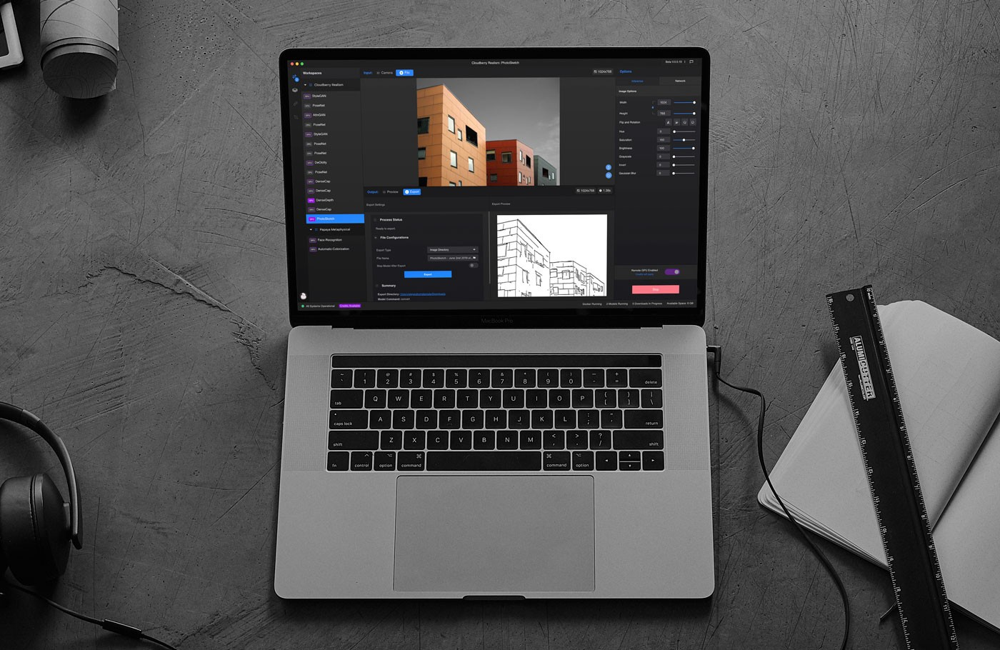
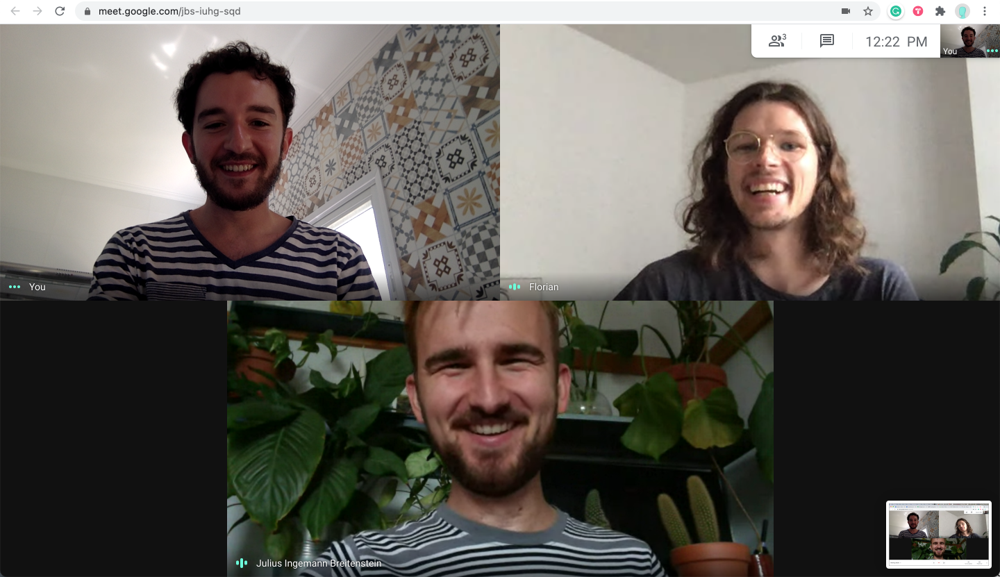

Generative Board Games is an exploration in the intersection between **artificial intelligence** and **creativity**. By using a **GPT-2** model, trained on over thousand board-game rules, we are able to generate unique instructions to never exisiting boardgames. Additionally to the instructions, a **StyleGAN** model generates the cover to the new game. You just have to provide a name to a game you want to play and let the AI do the rest.

<!-- end -->

## Making Generative Board Games

### The Idea

At some point, Julius had the idea to train a neural network with some board game rules to see what happens. Fast forward two months or so, and Generative Board Games happened.
Julius, a board game enthusiast and interaction designer I worked with previously, introduced me to Lucas Terra, a super talented designer from São Paulo, who works at Nubank. Together, we decided this idea of generating board games by using an AI is worth exploring, and so we started building a service that enables you to create your own game, browse a library of previously made games, and, of course, play them.

### RunwayML



The whole project was build around RunwayML. They provide a platform, which makes the interaction with machine learning as easy as creating an Instagram story (sort of). Click the model you want to use as a base (or create your own), train it with a data set (or leave it as it is), add it to your workspace, and start using it. Everything runs on their servers, so you don't have to worry about CPU, GPU, and so on.
They recently added a feature where you can host your model on their servers as a service. (AIaaS?) This is what we decided to use in the end. We pass the data as a request to the API endpoint and get back whatever the model gives us. It's great!

### Prototyping

Before jumping into building the actual app, we had to do some prototyping to get a proof of concept. The RunwayML app lets you set up and run a model in under five minutes, which helps you get some results to work with really fast.
Getting the data for training a model to produce first examples of board games takes a bit longer. First we had to get the actual training data for the models. Luckily, a lot of websites offer a big library of board game rules and covers. Building a web scraper for them isn't as hard as you might think. I wrote an article about this topic earlier. You can check it out if you're planning to do something in that direction.
Once the data is there, you can add it to RunwayML and start to train the model. In general, the more training steps, the more refined (better) the output will get.

<span class="full-size">


</span>

After some testing and adjusting, we had two trained models. One refined GPT2 model trained with over 2,500 game rules, and one StyleGAN model retrained with over 15,000 board game covers.

### Building

#### Environment

Eventually, we decided to go forward with the idea and build an actual thing out of it. Collaborating completely remotely has some challenges, but it's not hard do overcome those.
Managing the code in GitHub and using their own project management feature gives you a good overview of who's working on what and in which state it's in at the moment. Linking the tasks to pull requests helps you to keep track of the implementation and review the work of the team.

Figma was the main space where we played around with everything visual. You can create UI elements, user flows, mood boards, or assets for the page in no time. Also, discussing those ideas and adding opinions or remarks goes a long way in aligning everything.



By adjusting to the different time zones, team calls were, of course, also possible and provided a good opportunity to catch up and have a little digital coffee break.

#### Tech

For the app, we used the React.js framework Next.js with a custom Express.js server and a MongoDB for saving the created games.
I like the concept of being able to move front-end code to the back end and vice versa. It gives you the ability to sketch and prototype features very fast and move them around. If something needs more computing power or is data heavy, move it to the back end to take away the load from the client side.

#### Rule generation

The API for generating the text part of the board game has a max_characters restriction. This means, in this case, that you can only generate 1,024 characters with one API call.
For a complete rule set, this amount is too short. One solution for it was to chain multiple requests together and merge the results to one. Here you have to know that the AI text generator needs some input to build on top of.

Initially, you have to provide a name for the game you want to play  -  for example, "Personal Space Invaders." This will be used for the first batch of generated text.
Here comes the catch: To pick up the context for the next call, we take the response from RunwayML and use it as an input for the next call. Doing so allows the model to incorporate the already-produced text into the following calls, creating a continuous piece of content.

```javascript
// some pseudo code for handling the context

let counter = 0;

if (counter === 0) {
  input = gameName;
  counter += 1;
} else if (counter <= 3) {
  input = response.data.generatedText;
  counter += 1;
} else {
  counter = 0;
}

getRules(input);
```

You can chain those requests together as long as the API allows it and therefore bypass the max_character boundary.

Thanks to the RunwayML team for the support during and after the development!

#### Cover art generation

To get the cover of the game, we created a request with an array of 512 random floats as an input into the hosted model API from RunwayML. The way a StyleGAN works is that each of the 512 floats will be used as a style guide for the very image we want to have. You can read more about how this works in detail here.
On each request, a new random array will be constructed and handed to the hosted model. Since this is very random, the cover won't get any context from the game name you provided. There are ways of tackling that problem by implementing some sort of AttnGAN, for example, but we aren't at that point yet.

#### Putting it together

Now that we have the two key ingredients, we need some nice packaging. 
In Figma, we had the designs ready for implementation. Figma offers the feature to export the components and also to copy the styling, which accelerated the building process of the components most of the time.
With the help of three.js and spring-three-fiber (a three.js wrapper for React), we added a simple (but beautiful) digital box on which we loaded the produced image as a texture.
After all data is present on the client side, it can either be published to the list of previously generated games, downloaded as a PDF that you can print out and take to the next game night, or discarded so nobody will know about the game.

<span class="full-size">


</span>

#### Deployment

Thanks to GitHub Actions and Docker, the deployment was pretty straightforward. Once a new tag is pushed to the repository, the build process gets triggered. It packs everything together in a Docker image and pushes it to the Docker hub. Afterwards, the new Docker image will be pulled automatically into the web space and the service will restart.
I thought about using a Kubernetes cluster, but in this state, it's just too much overhead. Writing a little Bash script that handles the pulling and updating totally does the job for now.

### What We've Learned

In general, I learned a lot about the interaction with neural networks and how the different types can be used in different ways. Machine learning has its useful sides, but for now, in my opinion, it's more for supporting the creative process rather than taking it over entirely.
Working with a team that's fully remote and in different time zones was a good experience when it came to scheduling tasks and communication in general.
Also, I did get to know some new features in React and Next on the way, which is always a big plus.
Publishing a project that'll be open and usable by the public definitely comes with the challenge of coping with people's creations.

### Next Steps

There's no concrete next step with this project. After we released it, we'll work on some feedback, add little improvements, and see where it goes from there. 
It was always intended as a fun side project with no strings attached. If we happen to get access to the GPT-3 API or some other interesting things that could improve the experience, I'm sure we'll find some time to play around with it as well.
There's a donation button on the website since hosting the models and the app is costing us real money. If you like the project, you could help us keep it online and working for a bit longer.
Now generate your own game, and don't forget to have fun.
